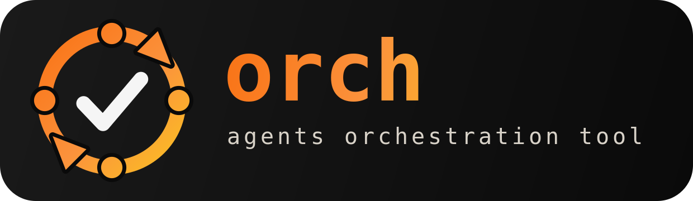

<p align="center">
  
</p>

# agent-orch

> [!WARNING]
> **License Notice**: `agent-orch` is a **Source-Available, Non-Commercial** project,
> licensed under [PolyForm Noncommercial 1.0.0](LICENSE) for educational, research,
> and other non-commercial use. **Commercial use is forbidden.**

## 🚨 Autonomous Agent Liability Disclaimer
`orch` operates via headless, autonomous agent loops designed to self-heal, modify codebase files, generate Pull Requests, and resolve issues dynamically. By running this software, you acknowledge that agents execute actions autonomously. The project creators accept **zero liability** for token expenses, infinite API loops, accidental data loss, or system vulnerabilities generated by autonomous actions. Always run inside a sandboxed environment.

Run two local coding agents (Claude, Codex) in a cross-audit loop on any git repo.
One authors a small change; the other audits it; on agreement + green tests it
merges to `main` locally; on disagreement it revises (capped); on stalemate it
asks you. All compute is local.

## Requirements
- Node ≥ 18
- At least one agent CLI on PATH: `claude`, `codex`, or `ccr` (for local-llm models)

## Install
Not yet published to npm — install from source. The CLI is exposed as `orch`:
```bash
git clone https://github.com/bbK1ngSrb/agent-orch.git
cd agent-orch
npm install -g .        # puts `orch` on your PATH
orch <command>
```
Prefer not to install globally? Run the CLI in place with `node bin/orch.js <command>`
from the cloned checkout.

## Usage
Run from inside the git repo you want orchestrated:
```bash
orch init                                  # scaffold .orch/orch.yml + .orch/ORCH.md, verify agent CLIs
orch init --link                           # also wire .orch/ORCH.md into CLAUDE.md/AGENTS.md/GEMINI.md
orch task "fix the flaky login test"       # author + cross-audit + test-gate + merge
orch task "fix x" --authors claude,codex --reviewers claude,codex
orch task --file wo.json                    # untrusted JSON work order (validated + fenced)
orch issue 42                               # fetch issue #42 as a work order, run the cycle, Closes #42
orch review pr/claude/some-branch          # audit an existing branch (no authoring)
orch pr 42                                  # audit a GitHub PR, post verdict as a comment
orch pr 42 --merge                          # ...and merge it via gh if agents approve
```
Add `--dry` to any `task`/`review` run to simulate a cycle without touching git,
agents, or tests. `orch` exits non-zero (`2`) when a cycle escalates for a human.

After a `task` run merges, `orch` tidies up for you: it pushes `main` to GitHub,
deletes the temporary work branches it created, returns your checkout to the
finished result, and prints a plain-English summary of what it did. Anything that
could lose work (e.g. a branch with unmerged commits) is explained and only removed
after you confirm `[y/N]`; with no terminal attached it is left untouched and noted.
Pass `--no-tidy` to skip this and leave every branch and checkout exactly as-is.

`--file` takes a JSON **work order** (untrusted intake — its free text is fenced,
never executed as instructions). `title` and `problem` are required; the arrays
may be empty:

```json
{ "title": "fix the flaky login test",
  "problem": "login test fails ~1 in 5 runs under load",
  "repro_steps": ["run npm test 5x"],
  "suspected_paths": ["src/auth.js"],
  "acceptance_criteria": ["test passes 20x in a row"] }
```

`orch pr <n>` needs the [`gh`] CLI authenticated. It fetches the PR head, runs an
audit-only cycle (local `main` is never touched — GitHub owns the merge), and
posts the verdict as a PR comment. With `--merge` it runs `gh pr merge` when the
agents approve and tests pass.

[`gh`]: https://cli.github.com/

## Agents
`claude`, `codex`, and three local-llm models served via llama-swap behind
claude-code-router (`ccr`): `qwen3-coder-30b`, `deepseek-coder-v2-lite`,
`glm-4.5-air`. Local models need `ccr` on PATH and `~/.claude-code-router/config.json`
defining a `local` provider (see `local-llm/configs/`).

> **External testers:** use the `claude` / `codex` CLI agents. `llama-swap` is
> host-specific (the maintainer's LAN proxy) and not required — the CLI-agent
> fallback already works.

Pick who authors and who audits explicitly in `orch.yml`:
```yaml
author: qwen3-coder-30b   # writes the change
reviewer: claude          # audits it
```
Set both or neither. Unset → the `agents:` list rotates author each cycle.
For parallel authors/reviewers, use plural lists:
```yaml
authors: [claude, codex]     # each writes a separate branch
reviewers: [claude, codex]   # all audit each branch, except its author
```
CLI flags override `orch.yml`: `--author/--reviewer` or comma-separated
`--authors/--reviewers`.

## Quickstart
```bash
cd your-repo
orch init
orch task "fix the flaky login test"
```

## Commands
- `orch init [--link]` — scaffold `.orch/orch.yml` + agent-agnostic `.orch/ORCH.md` usage doc, verify agent CLIs. `--link` appends an idempotent pointer to `.orch/ORCH.md` in the repo's `CLAUDE.md`/`AGENTS.md`/`GEMINI.md` (created for the configured agent if none exist). The `@.orch/ORCH.md` line auto-loads the doc in Claude Code; other agents read the prose pointer to it.
- `orch agent add <name>` — append a registered agent to `.orch/orch.yml`.
- `orch task "..."` — author + cross-audit + test-gate + merge.
- `orch issue <n>` — fetch GitHub issue #n (title+body, treated as an untrusted work order), run the full cycle, and stamp `Closes #n` on the no-ff merge so it auto-closes once main reaches origin. Needs the [`gh`] CLI authenticated.
- `orch review <branch>` — audit an existing branch.
- `orch pr <n> [--merge]` — audit a GitHub PR, comment the verdict, optionally merge via `gh`.
Add `--reviewer name` or `--reviewers a,b` to override review agents for
`review`/`pr` runs.

## Config (`.orch/orch.yml`, all optional)
See `orch.example.yml`. Most repos need no config. A bare `orch.yml` at the
repo root is still read for back-compat, but `.orch/orch.yml` wins if both exist.

## How it decides to merge
Merge happens only when every reviewer says `AGREE` **and** the repo's tests pass.
No test command detected → it refuses to auto-merge and tells you.

## Crash recovery
A killed `orch task` can leave worktrees under `.orch/wt`. Before starting, a run
sweeps those orphans. The sweep is PID-aware: each worktree carries an ownership
marker (`pid\nsid`); only worktrees whose owner process is dead are removed, so a
live peer's worktree is never disturbed. The branch is deleted **only** when an
orch-created marker is present **and** it carries no commits beyond `main` (a
killed-before-commit throwaway) — so a same-slug retry works, while a branch with a
committed author result is kept for resume (see below) and a branch you handed to
`orch review` is always preserved. `--dry` never deletes worktrees or branches.

`orch pr` is still serialized by `.orch/lock` (one at a time per repo dir); the same
PID-liveness logic lets a crashed `orch pr` be reclaimed on the next run.

**Resume after an abort or hard kill.** When an `orch task` cycle dies after the
author has committed — a usage-limit abort (issue #24) *or* a hard process kill /
SIGKILL between the commit and review (issue #27) — the committed work survives on its
branch, and the run is recorded in `.orch/resume/` keyed on the task text (with the
author). The next run with the **same task** reattaches that branch and continues from
the committed work (audit → gate → merge) instead of re-authoring from scratch — so
`harness/orch-loop.sh` resumes rather than restarts. Resume is independent of how the
run died and of author rotation: if the rotation pool has since advanced to a
different agent, the resuming run pins the surviving branch's original author rather
than authoring fresh under the next one. It restarts cleanly only if the run died
before any commit (nothing to resume), and never hijacks a live peer's branch.

## Concurrent cycles

Multiple `orch task` runs can drive the same repo directory in parallel. Launch
each with explicit author and reviewer roles so they don't round-robin into each
other:

```bash
orch task "migrate auth module"   --authors claude --reviewers codex &
orch task "add rate-limit header" --authors codex  --reviewers claude &
```

**Concurrency cap.** Set `concurrency: 4` in `.orch/orch.yml` (default 4). An
over-cap launch exits immediately with code 2 and logs:

```
orch: concurrency cap 4 reached — 5 cycles live; skipping pr/claude/<slug>-<sid>
```

Reduce the cap or wait for a live cycle to finish, then rerun.

**Launching from `main`.** The integration worktree keeps `main` checked out
inside `.orch/integration`; git forbids the same branch in two worktrees at
once. When you launch from `main`, orch automatically creates and switches to
an `orch/<task-slug>` branch at the current commit before the cycle starts:

```
orch: main is reserved for the integration worktree - created and switched to orch/<task-slug> (your changes carried over)
```

If that branch name already exists, orch appends `-2`, `-3`, and so on.
Uncommitted changes stay in your cwd; orch never stashes, resets, or discards
them.

**Merge path.** When all reviewers agree and tests pass, the cycle merges into
local `main` through `.orch/integration` under a brief `merge.lock` — no push.
Two guards run while the lock is held: a file-overlap pre-check (comparing your
changed paths against live peers' paths and anything that landed on `main` since
your cycle started) and a post-merge re-test against the integrated tree.

**PR-fallback.** A cycle demotes to a PR (or local escalation) when:
- `overlap` — your files collide with a concurrent cycle or a landed commit
- `conflict` — the merge itself fails
- `post-merge-test-fail` — tests fail after merge into `.orch/integration`
- `merge-lock timeout` — the lock was never acquired

With a git remote and `gh` CLI available, the branch is pushed and a PR is
opened. Without them, `.orch/reviews/<branch>/DECISION.md` is written and the
branch is kept for manual review.

## Auto docs-update on merge
Opt-in per repo. With `docs.autoUpdate: true` in `.orch/orch.yml`, a successful
merge auto-spawns a detached `orch task` that refreshes documentation:
```yaml
docs:
  autoUpdate: true   # off by default
  prompt: "update documentation to reflect the latest merged changes"
  paths: ["*.md", "docs/**", "**/*.md"]   # docs-only globs = loop guard
```
**Loop guard:** the trigger is skipped when the merged branch changed only docs
files (every path matches `docs.paths`) — so the docs-update's own docs-only
merge never re-triggers another one — and when the merge was a no-op (empty diff:
nothing to update, which would otherwise re-spawn forever). A mixed code+docs
merge triggers once.

**Two surfaces, no double-fire:**
- Local merges (`orch task`/`orch review`) — handled inside `orch` (above). No
  GitHub event, so only this surface sees them.
- GitHub PR merges (`orch pr --merge`, GitHub UI) — handled by the
  `.github/workflows/orch-docs.yml` Action (on `pull_request` closed+merged),
  which runs the same docs-update on the self-hosted `orch` runner and pushes to
  `main`. It applies the same docs-only loop guard.

**Portability:** the in-tool behavior ships inside `orch` — any standalone repo
gets it by setting `docs.autoUpdate: true`. The Action is a copy-paste template:
drop `orch-docs.yml` into another repo (e.g. printseek). It just needs `orch` on
the runner's PATH — the `npm install -g .` step assumes the repo vendors orch; a
repo that doesn't should install orch from an orch checkout instead.

## License
[PolyForm Noncommercial 1.0.0](LICENSE) — non-commercial use only; commercial use forbidden.
